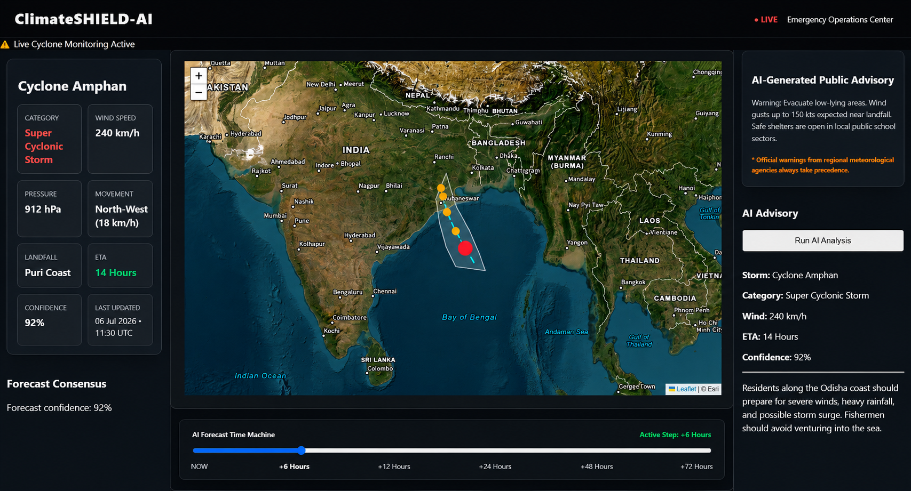
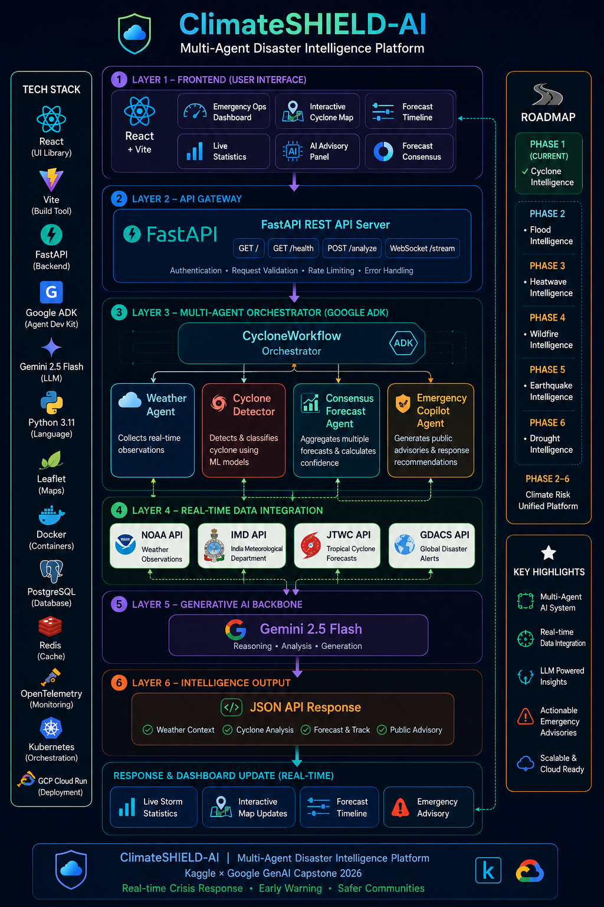
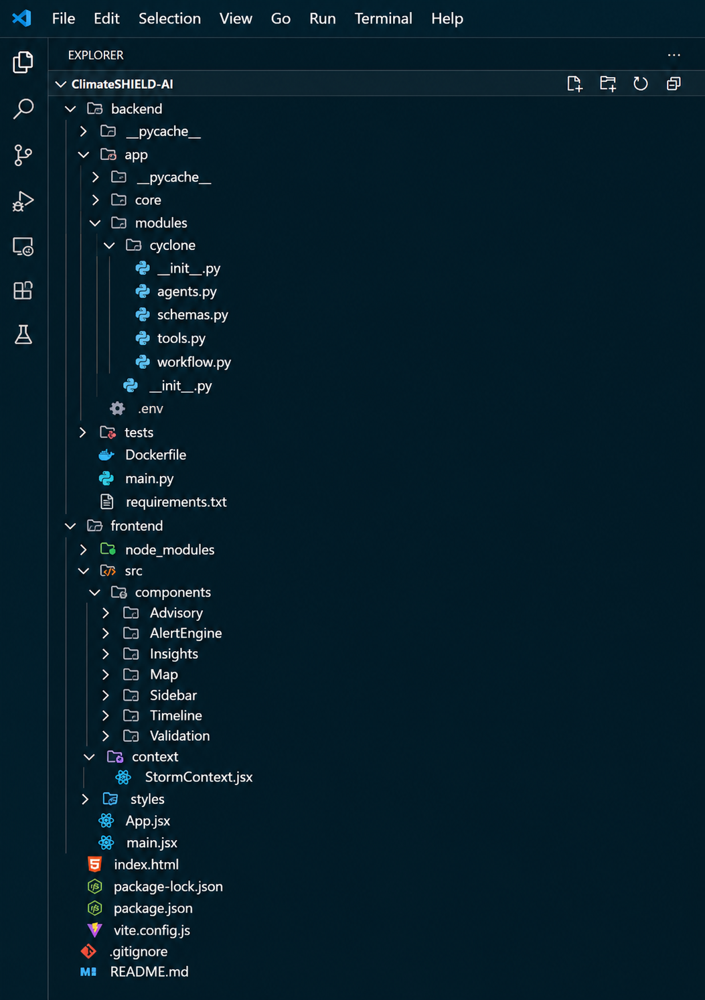
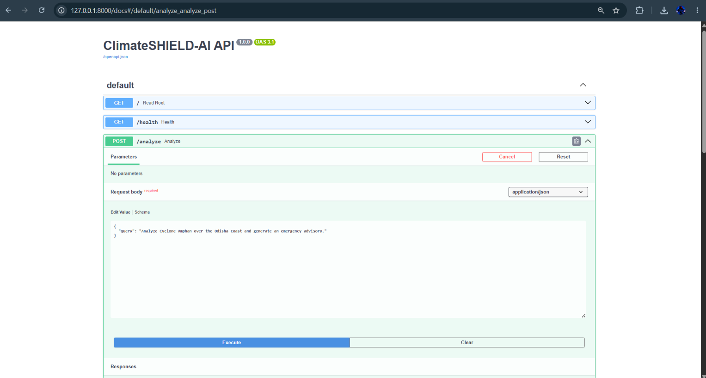
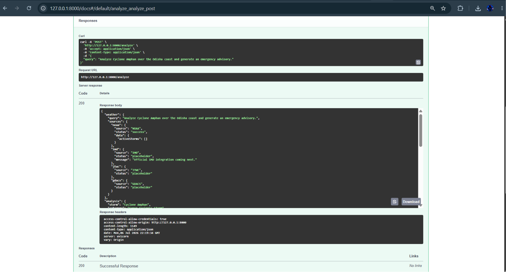
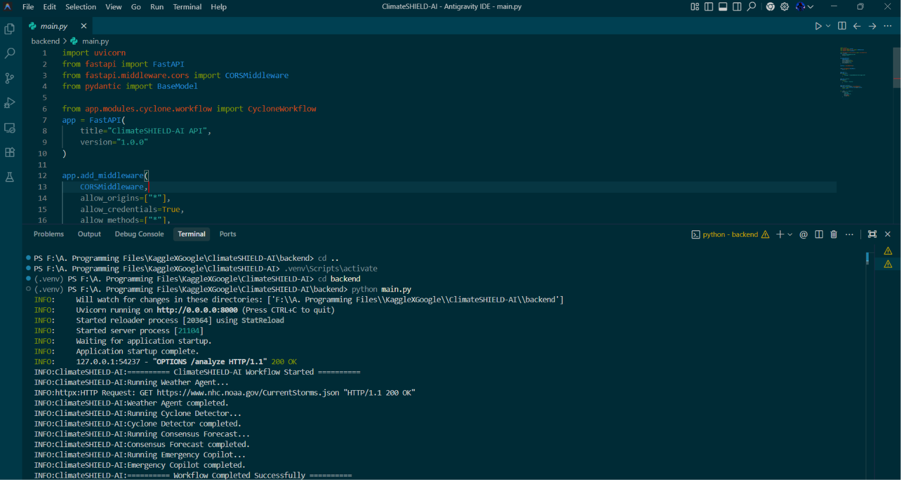

# 🌪️ ClimateSHIELD-AI

     



> **Multi-Agent Disaster Intelligence Platform built for the Kaggle × Google GenAI Capstone 2026**

---

# 📖 Overview

ClimateSHIELD-AI is an AI-powered disaster intelligence platform that helps emergency responders monitor, analyze, forecast, and respond to tropical cyclones using a collaborative multi-agent architecture.

The platform integrates meteorological observations from multiple weather agencies, processes them through specialized AI agents powered by Google ADK and Gemini 2.5 Flash, and presents actionable insights through an interactive Emergency Operations Dashboard.

---

## 📚 Table of Contents

- 🎯 Problem Statement
- 💡 Solution
- 🏗️ System Architecture
- 📁 Project Structure
- 🛠️ Technology Stack
- 🤖 Multi-Agent Workflow
- 📸 Application Preview
- 🚀 Installation
- ✅ Current Features
- 🛣️ Roadmap
- 🏆 Kaggle Capstone Alignment
- 🎥 Demo
- 👨‍💻 Author
- 📄 License

---

## ✨ Key Features

- 🌪️ Multi-Agent Cyclone Intelligence Workflow
- 🤖 Google ADK Agent Orchestration
- 🛰️ Multi-source Weather Integration (NOAA, IMD, JTWC, GDACS)
- 🧠 Gemini 2.5 Flash Reasoning
- 📊 Interactive React Dashboard
- 🗺️ Live Cyclone Map using Leaflet
- 📈 Forecast Timeline
- 🚨 AI-generated Public Advisory
- ⚡ FastAPI REST Backend

---

# 🎯 Problem Statement

Every year, tropical cyclones cause devastating damage through high winds, storm surges, flooding, and delayed emergency response. Critical information is often scattered across multiple meteorological agencies, making it difficult for responders to quickly assess the situation and make informed decisions.

Emergency teams must manually interpret weather bulletins, compare forecasts, and prepare public advisories under severe time pressure.

ClimateSHIELD-AI addresses this challenge by providing a unified AI-powered disaster intelligence platform that automatically gathers weather observations, analyzes cyclone activity, generates consensus forecasts, and produces actionable emergency advisories in a single dashboard.

---

# 💡 Solution

ClimateSHIELD-AI combines Google's Agent Development Kit (ADK), Gemini 2.5 Flash, FastAPI, and React into a multi-agent system designed specifically for disaster response.

Instead of relying on one large AI model, the platform distributes responsibilities among specialized AI agents:

- Weather Agent → Collects weather observations
- Cyclone Detector → Identifies cyclone characteristics
- Forecast Agent → Builds a consensus forecast
- Emergency Copilot → Generates public safety advisories

The frontend visualizes all outputs in an interactive Emergency Operations Center dashboard featuring:

- Live cyclone tracking
- Forecast timeline
- AI-generated advisory
- Confidence indicators
- Emergency response information

---

# 🏗️ System Architecture

The platform follows a layered multi-agent architecture where the frontend communicates with a FastAPI backend, which orchestrates specialized AI agents using Google ADK. Each agent performs a dedicated responsibility before producing a unified disaster intelligence response.



## Workflow

User
⬇
React Dashboard
⬇
FastAPI Backend
⬇
CycloneWorkflow (Google ADK)
⬇
Weather Agent
⬇
Cyclone Detector
⬇
Consensus Forecast Agent
⬇
Emergency Copilot
⬇
Gemini 2.5 Flash
⬇
JSON Response
⬇
Interactive Dashboard

---

# 📂 Project Structure

The project follows a modular architecture with a clear separation between the React frontend, FastAPI backend, and the AI agent workflow.



### Repository Layout

```text
ClimateSHIELD-AI
│
├── 📁 backend
│   │
│   ├── 📄 main.py
│   ├── 📄 requirements.txt
│   ├── 📄 Dockerfile
│   ├── 📄 .env
│   │
│   ├── 📁 app
│   │   ├── 📁 core
│   │   │   ├── base_module.py
│   │   │   ├── base_schema.py
│   │   │   ├── config.py
│   │   │   └── consensus.py
│   │   │
│   │   └── 📁 modules
│   │       └── 📁 cyclone
│   │           ├── __init__.py
│   │           ├── agents.py
│   │           ├── workflow.py
│   │           ├── tools.py
│   │           └── schemas.py
│   │
│   └── 📁 tests
│       ├── eval
│       └── unit
│
├── 📁 frontend
│   │
│   ├── 📄 package.json
│   ├── 📄 package-lock.json
│   ├── 📄 vite.config.js
│   ├── 📄 index.html
│   │
│   └── 📁 src
│       ├── 📄 App.jsx
│       ├── 📄 main.jsx
│       │
│       ├── 📁 context
│       │   └── StormContext.jsx
│       │
│       ├── 📁 components
│       │   ├── 📁 Advisory
│       │   │   └── AdvisoryCard.jsx
│       │   │
│       │   ├── 📁 AlertEngine
│       │   │   └── AlertTicker.jsx
│       │   │
│       │   ├── 📁 Insights
│       │   │   └── QAPanel.jsx
│       │   │
│       │   ├── 📁 Map
│       │   │   ├── MapViewer.jsx
│       │   │   ├── CycloneMarker.jsx
│       │   │   └── CycloneMarker.css
│       │   │
│       │   ├── 📁 Sidebar
│       │   │   └── StatsPanel.jsx
│       │   │
│       │   ├── 📁 Timeline
│       │   │   └── TimelineSlider.jsx
│       │   │
│       │   └── 📁 Validation
│       │       └── ConsensusGrid.jsx
│       │
│       └── 📁 assets
│
├── 📁 docs
│   ├── dashboard.png
│   ├── api-request.png
│   ├── api-response.png
│   ├── backend-workflow.png
│   └── architecture.png
│
└── 📄 README.md
```

---

# 🛠️ Technology Stack

| Category | Technology |
|----------|------------|
| Frontend | React + Vite |
| Backend | FastAPI |
| AI Framework | Google Agent Development Kit (ADK) |
| LLM | Gemini 2.5 Flash |
| Language | Python 3.11 |
| Mapping | Leaflet.js |
| Weather Sources | NOAA, IMD, JTWC, GDACS |
| API | REST API |
| Version Control | Git & GitHub |

---

# 🤖 Multi-Agent Workflow

ClimateSHIELD-AI follows a specialized multi-agent pipeline where each AI agent has a dedicated responsibility.

### 🌦️ Weather Agent
- Collects weather observations
- Integrates NOAA, IMD, JTWC and GDACS feeds
- Creates structured weather context

### 🌪️ Cyclone Detector
- Identifies cyclone name
- Detects category
- Extracts wind speed and pressure
- Generates structured cyclone analysis

### 📈 Consensus Forecast Agent
- Compares forecast sources
- Estimates landfall
- Computes confidence score
- Produces forecast timeline

### 🚨 Emergency Copilot
- Generates public safety advisories
- Recommends evacuation guidance
- Provides fisherman warnings
- Summarizes emergency actions

These agents are orchestrated sequentially using Google ADK through the `CycloneWorkflow` class before returning a unified JSON response to the frontend dashboard.

---

# 📸 Project Showcase

## Dashboard


---

## API Documentation

### Request



### Response



---

## Multi-Agent Workflow Execution



---

# 🚀 Installation

## 1. Clone the Repository

```bash
git clone https://github.com/Anirvan-07/ClimateSHIELD-AI.git

cd ClimateSHIELD-AI
```

---

## 2. Backend Setup

```bash
cd backend

python -m venv .venv

# Windows
.venv\Scripts\activate

# Linux / macOS
source .venv/bin/activate

pip install -r requirements.txt

python main.py
```

Backend runs at:

```
http://localhost:8000
```

Swagger API:

```
http://localhost:8000/docs
```

---

## 3. Frontend Setup

```bash
cd frontend

npm install

npm run dev
```

Frontend runs at:

```
http://localhost:3000
```
---

# ✅ Current Features

- Interactive cyclone monitoring dashboard
- Multi-Agent AI workflow
- Google ADK integration
- NOAA weather data integration (scaffold)
- Forecast timeline visualization
- AI-generated emergency advisory
- FastAPI REST API
- React + Leaflet frontend
- Backend workflow logging
- Modular architecture for future disaster intelligence modules

  ---

# 🛣️ Roadmap

## Phase 1 ✅
Cyclone Intelligence

## Phase 2
Flood Intelligence

## Phase 3
Heatwave Intelligence

## Phase 4
Wildfire Intelligence

## Phase 5
Earthquake Intelligence

## Phase 6
Unified Climate Risk Platform

### Planned Enhancements

- Live NOAA integration
- Live IMD bulletins
- JTWC forecast ingestion
- GDACS disaster alerts
- Native Google ADK Runner
- Sequential Agent orchestration
- Persistent memory
- Risk heatmaps
- District-level impact prediction

---

# 🏆 Kaggle × Google GenAI Capstone Alignment

### Track

**Agents for Good**

ClimateSHIELD-AI addresses disaster preparedness and emergency response by applying multi-agent AI systems to cyclone monitoring and public safety.

### Core Concepts Demonstrated

- Multi-Agent Systems
- Google Agent Development Kit (ADK)
- Tool Integration
- Context Engineering
- FastAPI REST Services
- Modular AI Workflow
- Interactive Visualization

---

# 🙏 Acknowledgements

This project was developed as part of the **Kaggle × Google 5-Day AI Agents Intensive Capstone**.

Special thanks to:

- Google AI
- Kaggle
- Google Agent Development Kit (ADK) Team
- NOAA
- India Meteorological Department (IMD)
- Joint Typhoon Warning Center (JTWC)
- Global Disaster Alert and Coordination System (GDACS)

---

# 👨‍💻 Author

**Anirvan Mohapatra**

B.Tech Computer Science & Engineering (AI & ML)

Sri Sri University

GitHub:
https://github.com/Anirvan-07
